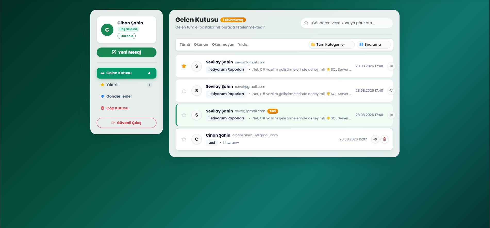
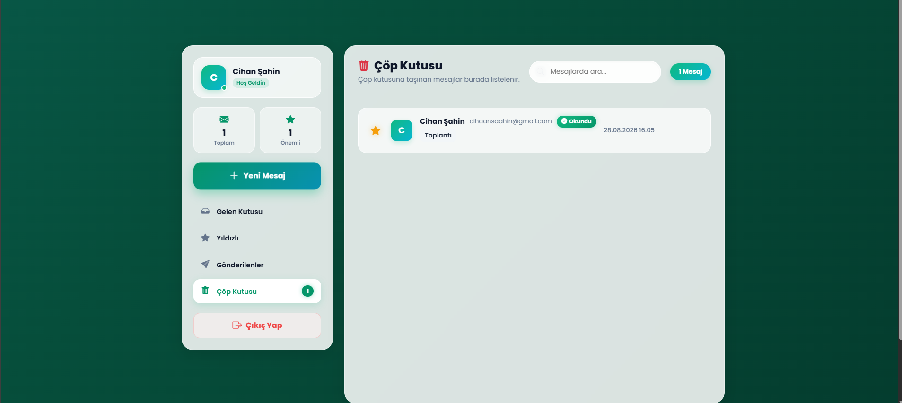
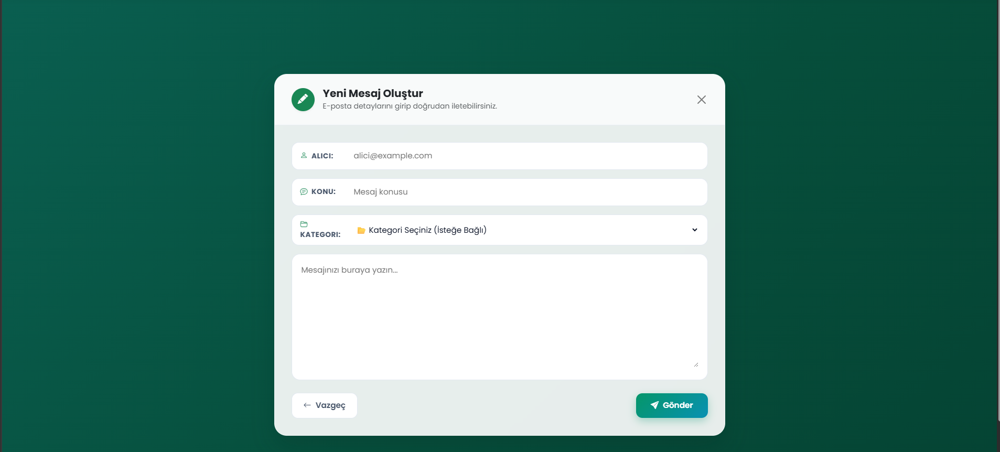
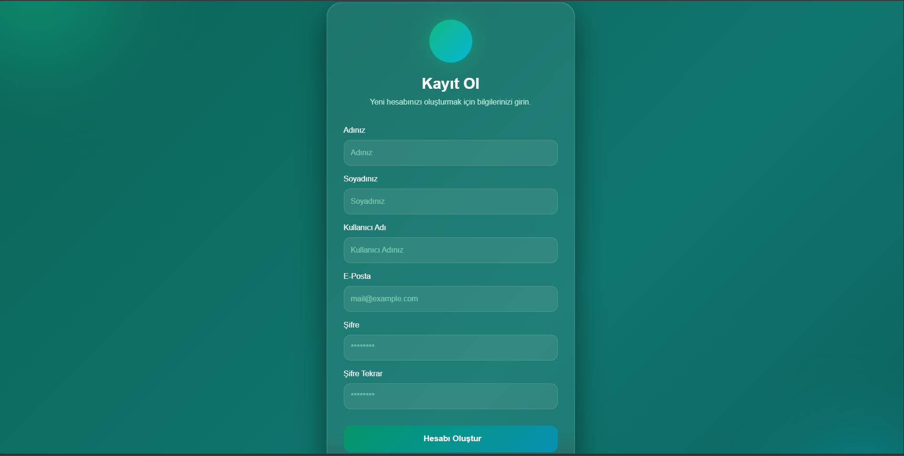
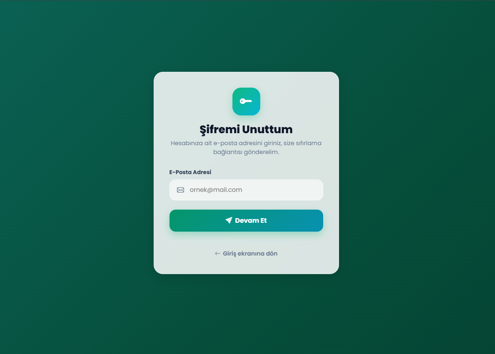
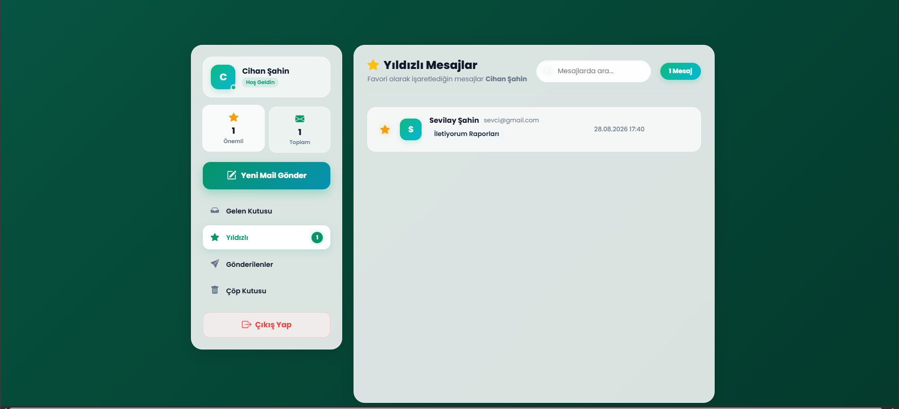

# IdentityMail

IdentityMail, ASP.NET Core (.NET 10) ile geliştirilen, kurumsal düzeyde kullanıcı kimlik doğrulama, rol yönetimi ve e‑posta/messaging işlevleri sağlayan bir uygulamadır. Eğitim amaçlı tasarlanmış olup, güvenli ve genişletilebilir bir mimari sunar.

## Özellikler
- Kullanıcı kayıt / giriş (ASP.NET Core Identity)
- Rol tabanlı yetkilendirme (Admin / User)
- Mesaj gönderme / alma, Gelen/Giden kutusu
- Çöp kutusu, geri yükleme, yıldızlama, okundu/okunmadı durumu
- Mesaj kategorileri, filtreleme ve sıralama
- Profil yönetimi
- Admin dashboard: kullanıcı ve rol yönetimi, istatistikler
- Responsive UI (Bootstrap 5)

## Teknolojiler
- .NET 10
- ASP.NET Core (Razor Pages / MVC)
- ASP.NET Core Identity
- Entity Framework Core (Code First & Migrations)
- SQL Server (localdb veya tam sürüm)
 - Razor View Engine, Bootstrap 5, HTML5, CSS3, JavaScript, LINQ

## Ekran görüntüleri
Resimler proje içindeki `IdentityMail.web/Img` klasöründe yer alıyor. Aşağıda bulunan örnekler repoda mevcut dosya adlarına göre ayarlanmıştır:

```









```

Not: Eğer `Img` klasörü farklı bir yerdeyse (ör. `wwwroot/Img`), yolları buna göre güncelleyin. Görsellerin GitHub üzerinde görünmemesi durumunda dosya isimlerinin büyük/küçük harf uyumunu, dosyaların commit edilip push edildiğini ve README'nin aynı dalda (branch) olduğunu doğrulayın.


## Geliştirme notları
- Proje .NET 10 hedeflidir; VS 2026 ile uyumludur.
- Razor Pages içeren kısımlara öncelik verilmiştir.
- Identity seed ve rol oluşturma `Program.cs` içinde yapılmıştır; üretim ortamı için başlangıç kullanıcı/rol oluşturma mantığını konfigüre edin veya migration/seed script kullanın.

## Katkıda bulunma
Pull request kabul edilir. Küçük değişiklikler için issue açabilirsiniz.

## Lisans
Proje lisansı belirtilmemiştir. Eğitim ve kişisel kullanım amaçlı olduğu kabul edilebilir; açık kaynak lisansı eklemek isterseniz `LICENSE` dosyası ekleyin.

---

Hazırlayan: Cihaan Şahin — MyAcademy_IdentityMailProject (.NET 10)
