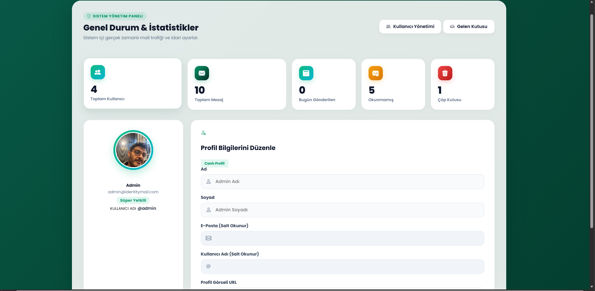
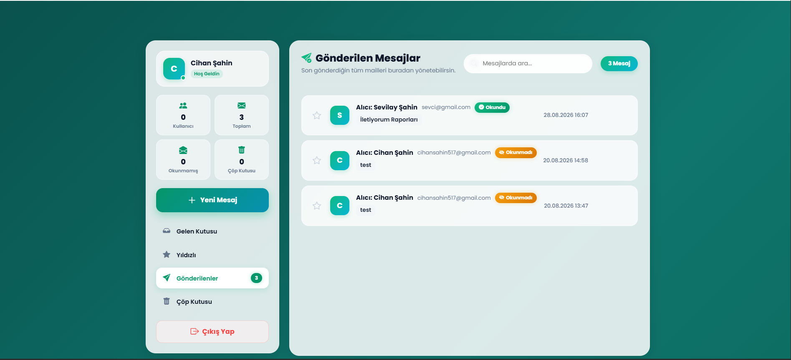
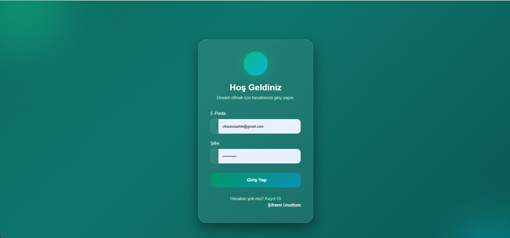

# IdentityMail

M&Y Yazılım Eğitim Akademi Danışmanlık 11. dönem öğrencisi olarak, değerli eğitmenim Erhan Gündüz'ün rehberliğinde geliştirdiğim IdentityMail projesi. .NET 10 (Razor Pages / MVC) kullanılarak hazırlanmış, kimlik doğrulama, rol yönetimi ve e‑posta/messaging özellikleri içeren gerçek dünya kullanımına uygun bir e‑posta yönetim sistemi.

## Özellikler
- Kullanıcı kayıt / giriş (ASP.NET Core Identity)
- Rol tabanlı yetkilendirme (Admin / User)
- Mesaj gönderme / alma, Gelen/Giden kutusu
- Çöp kutusu, geri yükleme, yıldızlama, okundu/okunmadı durumu
- Mesaj kategorileri, filtreleme ve sıralama
- Profil yönetimi
- Admin dashboard: kullanıcı ve rol yönetimi, istatistikler
- Responsive UI (Bootstrap 5)

## Teknolojiler
- .NET 10
- ASP.NET Core (Razor Pages / MVC)
- ASP.NET Core Identity
- Entity Framework Core (Code First & Migrations)
- SQL Server (localdb veya tam sürüm)
- Razor View Engine, Bootstrap 5, HTML5, CSS3, JavaScript, LINQ

## Önkoşullar
- .NET 10 SDK yüklü
- SQL Server veya LocalDB
- Visual Studio 2026 (tercih) veya VS Code

## Hızlı kurulum
1. Depoyu klonlayın:

   git clone https://github.com/Cihaansaahin/MyAcademy_IdentityMailProject.git

2. Çözümü Visual Studio ile açın: `MyAcademy_IdentityMailProject.slnx` veya terminalde proje klasörünü kullanın.

3. `appsettings.json` içindeki `DefaultConnection` değerini kendi veritabanınıza göre güncelleyin.

4. Migration ve veritabanı güncellemesi:
   - Paket Yöneticisi Konsolu (VS): `Update-Database -Project IdentityMail.web`
   - veya dotnet-ef CLI: `dotnet ef database update --project IdentityMail.web`

5. Uygulamayı çalıştırın:
   - Visual Studio'dan Debug/Run, veya terminalden:
	 `dotnet run --project IdentityMail.web`

## Ekran görüntüleri

```



```


## Geliştirme notları
- Proje .NET 10 hedeflidir; VS 2026 ile uyumludur.
- Razor Pages içeren kısımlara öncelik verilmiştir.
- Identity seed ve rol oluşturma `Program.cs` içinde yapılmıştır; üretim ortamı için başlangıç kullanıcı/rol oluşturma mantığını konfigüre edin veya migration/seed script kullanın.

## Katkıda bulunma
Pull request kabul edilir. Küçük değişiklikler için issue açabilirsiniz.

## Lisans
Proje lisansı belirtilmemiştir. Eğitim ve kişisel kullanım amaçlı olduğu kabul edilebilir; açık kaynak lisansı eklemek isterseniz `LICENSE` dosyası ekleyin.

---

Hazırlayan: Cihaan Şahin — MyAcademy_IdentityMailProject (.NET 10)
